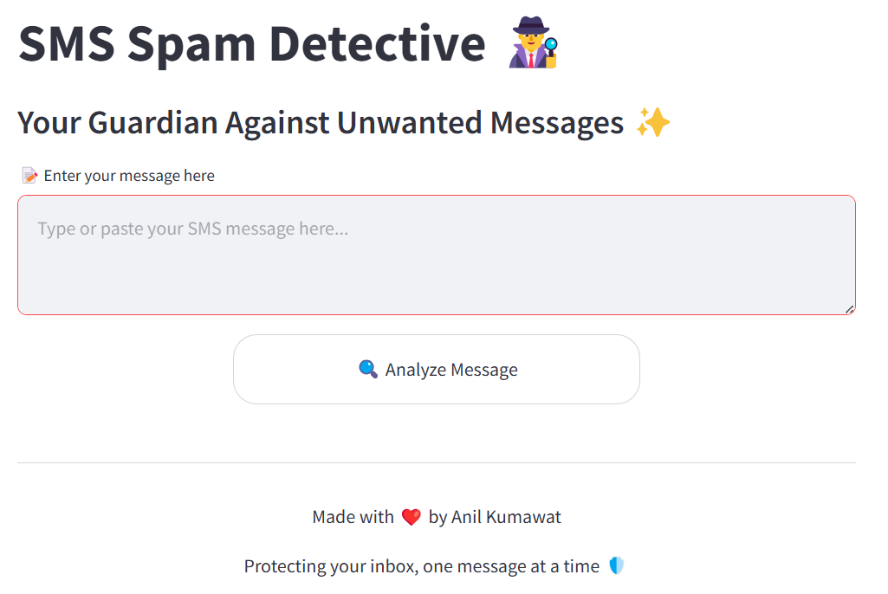
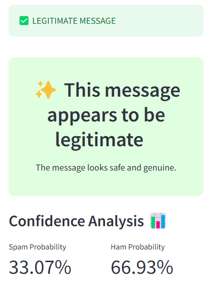
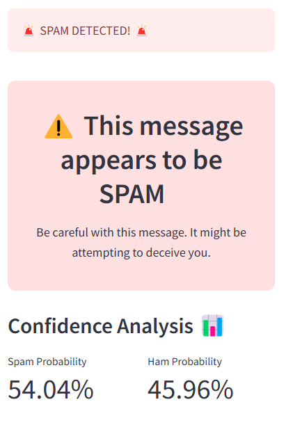
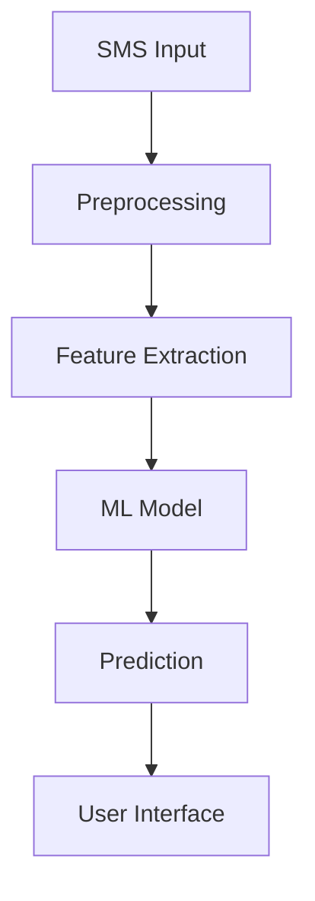
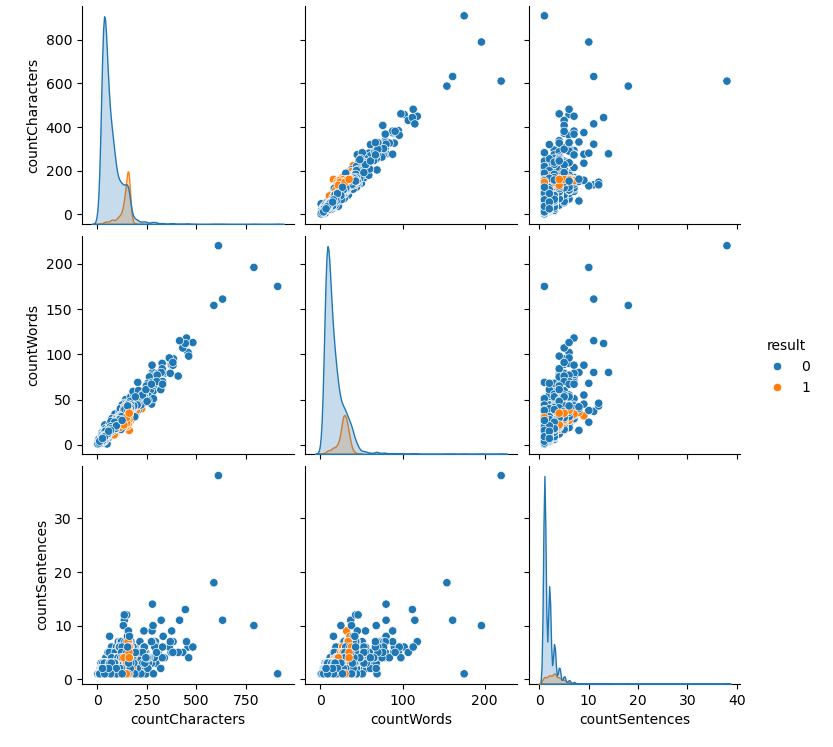

# 📱 SMS Spam Detection System
> A machine learning-powered application that helps protect users from unwanted spam messages.

🚀 **Check out the live version of the application here:** [Streamlit App](https://anil-kumt-spam-detection.streamlit.app/)





## 🌟 Overview
This SMS Spam Detection system leverages machine learning algorithms to accurately classify messages as spam or legitimate. Built with Python and deployed as a user-friendly web application using Streamlit, it offers real-time message classification to help users maintain a clean, spam-free messaging experience.

<div style="display: flex; justify-content: center; gap: 20px;">
  
  
</div>


## ✨ Key Features
- 🔍 Real-time SMS classification
- 📊 100% precision in spam detection
- 🎯 User-friendly web interface
- 📈 Comprehensive data analysis
- 🛠️ Multiple ML models comparison
- 🔄 Continuous improvement capability

## 🚀 Live Demo
Experience the application in action: [Live Demo Link](https://anil-kumt-spam-detection.streamlit.app/)


## 🛠️ Technology Stack
- **Python** - Core programming language
- **Scikit-learn** - Machine learning implementations
- **Pandas** - Data manipulation and analysis
- **NumPy** - Numerical computations
- **Streamlit** - Web application framework
- **NLTK** - Natural Language Processing

## 📊 Project Architecture




## 💡 Technical Implementation

### 1. Data Engineering 🔧
- **Dataset**: 5,500+ SMS messages from Kaggle
- **Preprocessing Pipeline**:
  - Text tokenization
  - Special character removal
  - Stop word elimination
  - Text stemming
  - Case normalization

### 2. Exploratory Data Analysis 📈
Our comprehensive EDA revealed fascinating insights:
- Message length distribution analysis
- Word frequency patterns
- Spam vs. Ham message characteristics
- Correlation studies

<div style="text-align: center;">
  
</div>


## 🚀 Getting Started

### Prerequisites
- Python 3.8+
- pip package manager

### Installation Steps
1. Clone the repository:
```bash
git clone https://github.com/AnilKumt/spam_detection
cd sms-spam-detection
```

2. Install dependencies:
```bash
pip install -r requirements.txt
```

3. Launch the application:
```bash
streamlit run app.py
```

4. Open your browser and navigate to `localhost:8501`

## 📱 Usage Guide
1. Access the web interface
2. Enter or paste your SMS message
3. Click "Analyze"
4. Receive instant classification results


## 🎯 Future Enhancements
- [ ] Multi-language support
- [ ] API integration capabilities
- [ ] Mobile application development
- [ ] Real-time learning from user feedback
- [ ] Browser extension development

## 🤝 Contributing
I welcome contributions! Here's how you can help:

1. Fork the repository
2. Create your feature branch (`git checkout -b feature/AmazingFeature`)
3. Commit your changes (`git commit -m 'Add some AmazingFeature'`)
4. Push to the branch (`git push origin feature/AmazingFeature`)
5. Open a Pull Request


## 👏 Acknowledgments
- Kaggle for providing the initial dataset
- The open-source community for invaluable tools
- All contributors who help improve this project

🚀 **Check out the live version of the application here:** [Streamlit App](https://anil-kumt-spam-detection.streamlit.app/)

Project Link: [https://github.com/AnilKumt/spam_detection](https://github.com/AnilKumt/spam_detection)

---
⭐ Star this repository if you find it helpful!
